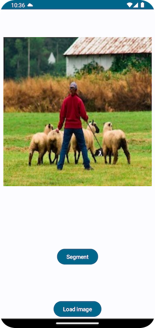
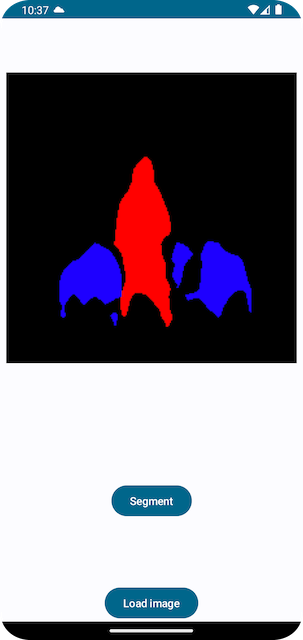
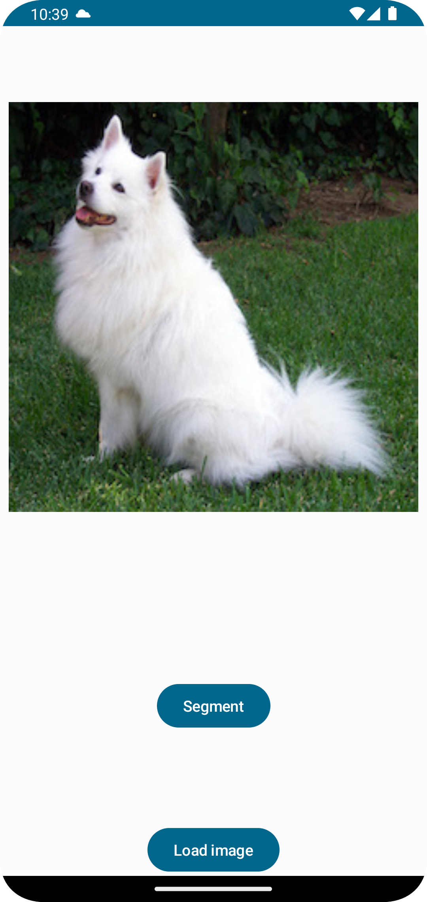

# Semantic Image Segmentation DeepLabV3 with Mobile Interpreter on Android

## Introduction

This repo offers a Python script that converts the [PyTorch DeepLabV3 model](https://pytorch.org/hub/pytorch_vision_deeplabv3_resnet101) to the Lite Interpreter version of model, also optimized for mobile, and an Android app that uses the model to segment images.

## Prerequisites

* PyTorch 1.10.0 and torchvision 0.11.1 (Optional)
* Python 3.8 or above (Optional)
* Android Pytorch library pytorch_android_lite:1.10.0, pytorch_android_torchvision_lite:1.10.0
* Android Studio 4.0.1 or later

## Quick Start

To Test Run the Image Segmentation Android App, follow the steps below:

### 1. Prepare the Model

We need to generate the model, open a terminal window, first install PyTorch 1.10.0 and torchvision 0.11.1 using command like `pip install torch torchvision`, then run the following commands:

```
git clone https://github.com/ehocine/PyTorchSample
cd PytorchSample
python deeplabv3.py
```

The Python script `deeplabv3.py` is used to generate the TorchScript-formatted models for mobile apps. For comparison, three versions of the model are generated: a full JIT version of the model, a Mobile Interpreter version of the model which is not optimized for mobile, and a Mobile Interpreter version of the model which is optimized for mobile, named as `deeplabv3_scripted_optimized.ptl`. The last one is what should be used in mobile apps, as its inference speed is over 60% faster than the non-optimized Mobile Interpreter model, which is about 6% faster than the non-optimized full JIT model.


### 2. Use Android Studio

Open the ImageSegmentation project using Android Studio. Note the app's `build.gradle` file has the following lines:

```
implementation("org.pytorch:pytorch_android_lite:1.13.1")
implementation("org.pytorch:pytorch_android_torchvision_lite:1.13.1")
```

The code below is used to load the model:

```
 mModule = LiteModuleLoader.load(
                assetFilePath(
                    application,
                    "deeplabv3_scripted_optimized.ptl"
                )
            )
```

### 3. Run the app
Select an Android emulator or device and build and run the app. The example image and its segmented result are as follows:





